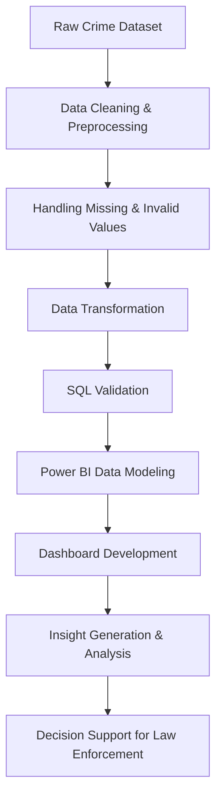

**Download_PowerBI_Dashboard : https://drive.google.com/file/d/1SywnwnkXFgth_sVOB-OSoP14pr7CdxGG/view?usp=sharing**
**dataset_link  : https://data.lacity.org/Public-Safety/Crime-Data-from-2010-to-2019/63jg-8b9z/about_data**

# Los Angeles Crime Analytics Dashboard


## 📌 Project Overview

The **Los Angeles Crime Analytics Dashboard** is a data analytics project designed to analyze crime incidents across Los Angeles from **2015 to 2019**. The project transforms raw crime data into meaningful business insights using **Power BI**, **SQL**, and **data cleaning techniques**.

The dashboard helps identify:

* High-crime areas
* Crime trends over time
* Peak crime hours and days
* Most dangerous crime categories
* Case resolution status
* Weapon involvement trends

This project demonstrates practical skills in:

* Data Cleaning
* ETL Process
* Data Modeling
* SQL Validation
* Dashboard Design
* Data Visualization
* Insight Generation

---

# 🎯 Problem Statement

Law enforcement agencies in Los Angeles face increasing crime incidents every year. However, without a centralized analytics system, it becomes difficult to:

* Identify high-risk areas
* Monitor crime patterns
* Allocate police resources efficiently
* Track unresolved cases
* Analyze crime severity and weapon usage

The goal of this project is to build an interactive analytics dashboard that supports data-driven decision-making for public safety improvement.

---

# 🗂 Dataset Information

### Dataset Scope

The dataset contains crime records from **2015 to 2019**.

### Dataset Features

The dataset includes:

| Column                 | Description                |
| ---------------------- | -------------------------- |
| Date Occurred          | Date of crime incident     |
| Time Occurred          | Time of crime              |
| Area Name              | Location/area of incident  |
| Crime Code Description | Type of crime              |
| Victim Age             | Victim age information     |
| Victim Gender          | Gender of victim           |
| Weapon Description     | Weapon used in crime       |
| Status Description     | Resolved/Unresolved status |
| Latitude & Longitude   | Geographical coordinates   |
| Premise Description    | Crime location type        |

---

# ⚙️ Technologies Used

| Technology | Purpose                            |
| ---------- | ---------------------------------- |
| Power BI   | Dashboard creation & visualization |
| SQL        | Data validation & analysis         |
| Python     | Data cleaning & preprocessing      |
| Excel/CSV  | Data storage & preparation         |

---

# 🔄 Project Workflow

## Data Flow Diagram



---

# 🧹 Data Cleaning & Preparation

Several preprocessing and cleaning operations were performed to improve data quality and ensure accurate analysis.

### Cleaning Steps Performed

* Removed duplicate records
* Handled missing/null values
* Replaced invalid victim age values
* Standardized categorical fields
* Converted date/time columns into usable formats
* Cleaned inconsistent text values
* Improved data consistency for visualization

### Example: Victim Age Cleaning

Some records contained unrealistic victim ages such as:

* Age ≤ 0
* Missing values
* Invalid entries

These values were replaced with:

```text
Unknown
```

This improved consistency and prevented inaccurate analysis.

---

# 🗃 Data Modeling

The cleaned dataset was imported into Power BI and modeled for efficient reporting.

### Modeling Techniques

* Relationship creation
* Star schema concepts
* Calculated columns
* DAX measures
* Time-based analysis

---

# 📊 Dashboard Features

## 1️⃣ Crime Overview Dashboard

The overview dashboard provides high-level crime insights.

### Key Metrics

* Total Crimes
* Crimes by Area
* Crimes by Time of Day
* Crimes by Premise Type
* Crimes by Year
* Crime Category Analysis

### Key Findings

* Southwest area recorded the highest crime volume (~70K incidents)
* Afternoon had the highest crime activity (~350K crimes)
* Residential premises showed the highest risk (~380K crimes)
* Theft & Auto Theft was the top crime category (~590K cases)
* Peak crime year was 2017

---

## 2️⃣ Crime Detailed Dashboard

The detailed dashboard focuses on deeper trend analysis.

### Dashboard Insights

* Weekend afternoons showed the highest crime activity
* Friday and Saturday were peak crime days
* Crime activity was highest between 12 PM – 8 PM
* Weapon-related incidents represented a significant threat
* Large percentage of cases remained unresolved

---

# 📈 Key Business Insights

## 🚔 Patrol Resource Allocation

* Increase patrol units in the Southwest area
* Strengthen afternoon and weekend policing
* Focus on Friday and Saturday shifts

## 🏘 Public Safety Risk Areas

* Residential premises require improved security measures
* Theft and Auto Theft prevention campaigns are needed
* Faster response systems required for weapon-related crimes

## 📉 Crime Resolution Analysis

* Large percentage of crimes remained unresolved
* Additional investigation resources are necessary
* Serious unresolved cases should be prioritized

---

# ✅ SQL Validation Process

SQL was used to validate the accuracy of transformed data.

### Validation Objectives

* Compare cleaned data with raw records
* Verify totals and aggregations
* Cross-check dashboard calculations
* Ensure consistency between source and reporting layers

# 📌 Dashboard KPIs

| KPI                   | Description                  |
| --------------------- | ---------------------------- |
| Total Crimes          | Overall crime incidents      |
| Crime Resolution Rate | Percentage of solved cases   |
| Weapon Involvement    | Crimes involving weapons     |
| High Crime Areas      | Areas with maximum incidents |
| Peak Crime Time       | Most active crime periods    |
| Crime Category Trends | Most frequent crime types    |

# 🚀 Future Improvements

Possible future enhancements include:

* Real-time crime monitoring
* Predictive crime analysis using Machine Learning
* Geographic heat maps
* Integration with live public safety APIs
* Advanced forecasting dashboards
* Cloud deployment using Azure or AWS

---

# 📚 Learning Outcomes

This project helped strengthen practical skills in:

* Data analytics workflow
* Dashboard storytelling
* SQL querying
* Data validation techniques
* ETL process understanding
* Power BI dashboard development
* Business insight generation


# 💡 Conclusion

Behind every data point is a real-world incident. By analyzing crime trends, patterns, and severity, this project provides actionable insights that can support smarter policing strategies and better public safety planning.

The dashboard demonstrates how data analytics can transform raw crime records into meaningful and impactful decision-making tools.

# 👨‍💻 Author

## Muhammad Hasnain

**Data Analyst / Data Engineer**

* Computer Science Graduate – UBIT
* Skilled in SQL, Python, Excel, and Power BI
* Experience in Data Cleaning, ETL, Data Modeling & Dashboards
* Currently Learning Cloud Data Engineering
